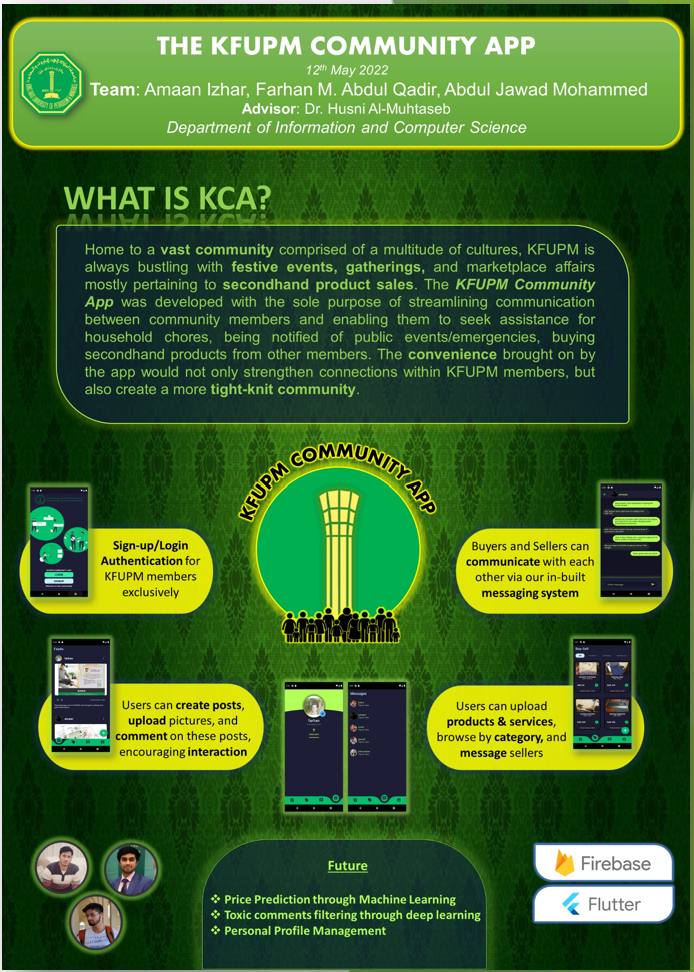
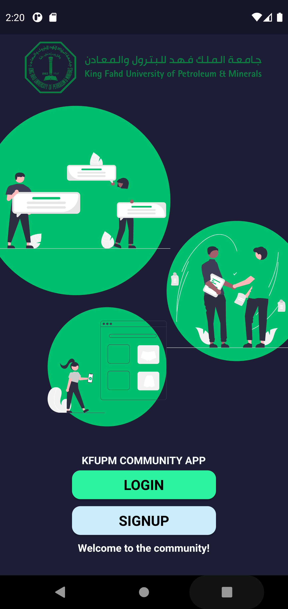
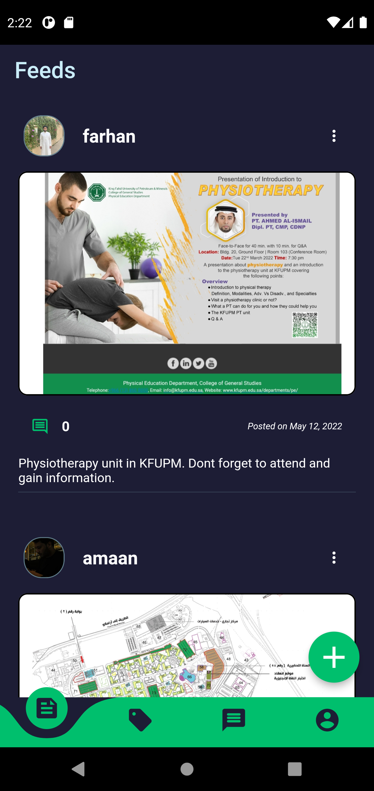
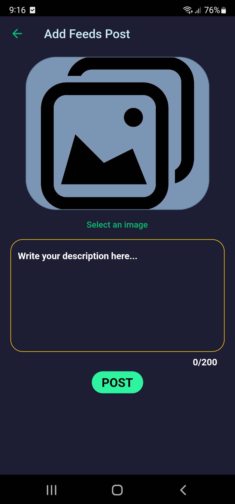
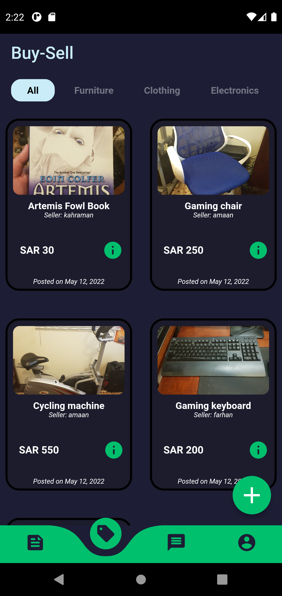
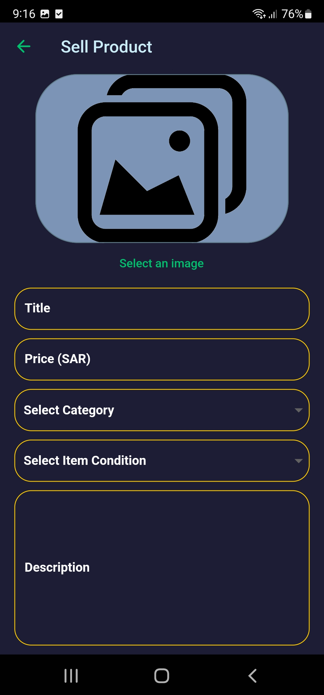
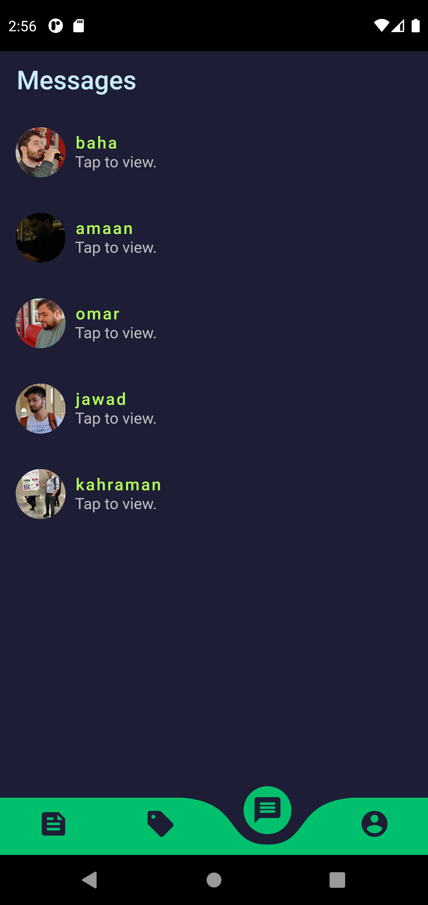
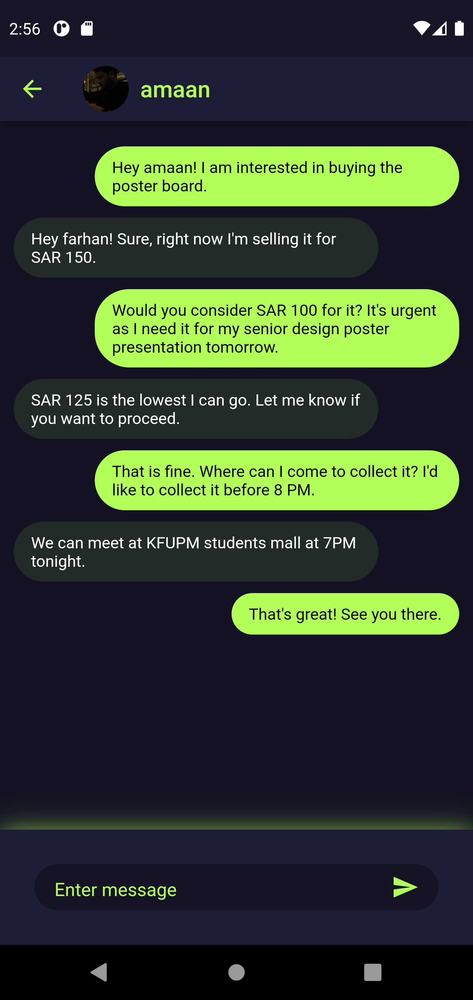

# Kfupm Community App (KCA)
  
  
  
  
  Senior Design Project: ICS 411/212

## Description

## Screenshots Of The Application

  
Click to expand!

   
  
   

 

 

 

 

 ## Project Partners/Contributors
   - [Farhan AbdulQadir](https://github.com/Vegeterian)
   - [AbdulJawad Mohammed](https://github.com/abbaddon1001)
